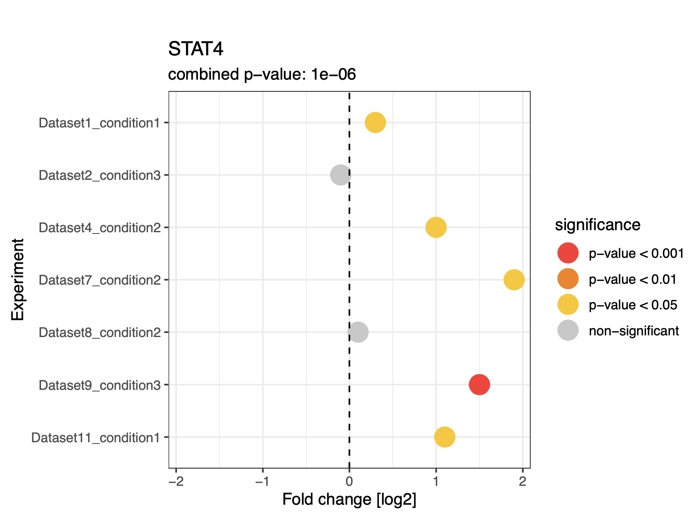
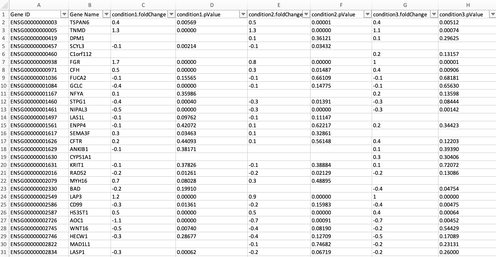
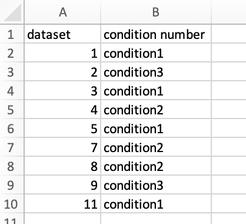

# Simple_MetaStudy
R workflow to perform a "simple meta analysis" on multiple manually curated bioinformatics datasets. The "meta analysis" aspect here comes in the form of [Fisher's Method](https://en.wikipedia.org/wiki/Fisher%27s_method), which combines the results (i.e., p-values) of multiple independent hypothesis tests for the same H0/H1 hypotheses to obtain combined p-values. The main idea behind the script therefore is to pool information from multiple distinct but overall similar omics differential expression datasets (e.g. "healthy" vs "diseased" in various patients; "WT" vs "KO" in various tissues, etc.) on the level of individual genes/proteins, thereby increasing statistical power to detect biological trends. This is of particular relevance since individual omics experiments are often conducted with low numbers of biological replicates. The following plot for STAT4 demonstrates the script's purpose nicely (note that the combined p-value is written on top of the plot):




## Contents

- **MetaStudy.Rmd** : R markdown script that performs the meta analysis for specified genes via Fisher's method, given input data files with specific formatting. The beginning of the script contains a parameter section where analysis settings are configured (e.g. file paths to input files; info on which genes to look at; etc.). The current parameter settings are specific to the example dataset (see below). Apart from the parameter section, the rest of the script should be left untouched. I recommend knitting the script to create a html report, which will further automatically save all created figures in pdf format in a separate folder.

- **example.pdf** : An example html report produced by running and knitting "MetaStudy.Rmd", using the example datasets as input. Check out this html report to see what the script does.

- **Datasets**: A folder containing example datasets (one tsv file per unique omics experiment) which were used as the script's input to generate "example.pdf" (think of it like a Demo). The individual differential expression result tables were downloaded from the [Expression Atlas](https://www.ebi.ac.uk/gxa/home) open science resource. Note that column headers of the individual tables were slightly modified to follow a standardized format which allows easy reading-in and data processing. 

- **figures**: A folder containing png and pdf images of all plots created by running the script on the example datasets.

- **Condition_datasets_11012023.csv**: A table specific to the analysis of the example dataset, which is another required input of the script. Tells the script which data sets and which conditions (i.e. pairwise group comparisons) within those data sets should be compiled to perform the meta analysis.


## Required Data Input 

- A folder named **Datasets** containing various manually curated tsv files, each one containing differential expression testing results of one distinct omics experiment. File names of tables should start with the regular expression pattern "DatasetX ", where X is a unique integer. Each table is required to list genes as rows and differential expression testing results (i.e. fold change and p-values) for one or more conditions (i.e. pairwise comparisons) as columns, in addition to a mandatory "Gene Name" column. Within each table, for each unique condition (i.e., distinct pairwise comparison) numbered Y, the two columns "conditionY.foldChange" and "conditionY.pValue" are required. Here is an example:



- A table with arbitrary naming (e.g. **Condition_datasets_11012023.csv** in the above example) that details which conditions (i.e. pairwise comparisons) in which data sets should be included in the meta analysis. Should contain the two columns "dataset" and "condition number"; entries should match the numbering of file names and condition numbers within. Here is an example:




## Data Output


- A html report created when knitting the Rmd file.
- various plots/figures, saved in the "figures" folder as both pdf and png files.


## Things to Note:

- Be wary of opening any tables in Excel, as this might convert gene names into dates. I recommend using a text editor for adjusting the column names of input tables.
- Note that this form of meta analysis does not consider the direction of differential expression (i.e. the sign of the fold change; it just considers the p-value).  This in itself is not wrong (this just means that H1 is more generic, e.g. "geneA is differentially expressed" instead of "geneA is differentially expressed with positive fold change"), but maybe not ideal.
- Note that Fisher's Method assumes that all individual tests are independent but test for the same overall H0/H1 hypotheses. Both assumptions might not always be perfectly fulfilled, e.g. when two conditions (i.e. pairwise comparisons) are from the same data set; or when two distinct experiments or pairwise comparisons address slightly different questions (e.g. treatment effect after 5 days vs treatment effect after 7 days). Still, if there is no major violation of the statistical assumptions (e.g. compare with assumption of normality in t-testing or ANOVA), the results should be valid, but it is best to keep this caveat in mind. 


## Session Info

```
R version 4.3.2 (2023-10-31)
Platform: x86_64-apple-darwin20 (64-bit)
Running under: macOS Big Sur 11.7.10

Matrix products: default
BLAS:   /System/Library/Frameworks/Accelerate.framework/Versions/A/Frameworks/vecLib.framework/Versions/A/libBLAS.dylib 
LAPACK: /Library/Frameworks/R.framework/Versions/4.3-x86_64/Resources/lib/libRlapack.dylib;  LAPACK version 3.11.0

locale:
[1] en_US.UTF-8/en_US.UTF-8/en_US.UTF-8/C/en_US.UTF-8/en_US.UTF-8

time zone: Europe/Vienna
tzcode source: internal

attached base packages:
[1] stats     graphics  grDevices utils     datasets  methods   base     

other attached packages:
 [1] gplots_3.1.3       superheat_0.1.0    poolr_1.1-1        rlist_0.4.6.2      RColorBrewer_1.1-3 lubridate_1.9.3    forcats_1.0.0     
 [8] stringr_1.5.0      dplyr_1.1.3        purrr_1.0.2        readr_2.1.4        tidyr_1.3.0        tibble_3.2.1       tidyverse_2.0.0   
[15] ggplot2_3.4.4     
```


## Used Libraries and other Resources


- ggplot2: Wickham H (2016). ggplot2: Elegant Graphics for Data Analysis. (Springer-Verlag New York).
- poolR: Cinar, O., & Viechtbauer, W. (2022). The poolr Package for Combining Independent and Dependent p Values. Journal of Statistical Software, 101(1), 1–42.


